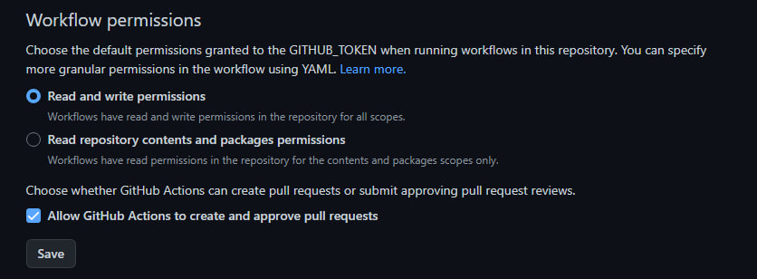

# webpack-template

### You need to edit the homepage field in the package.json file by inserting your data according to the example below:

```javascript
"homepage": "https://<your-user-name>.github.io/<repo-name>",
```

#

### Also set the rights for correct work as shown in the example below:



#

### Install the project's base dependencies with the "`npm install`" command.

#### Start development mode by running the "`npm start`" command.
#### Build the project by running the "`npm run build`" command.
#### Clean up the "dist" folder by running the "`npm run clean`" command.

#

### If you want to use `<include>` in "parshals" for html, then in links to other files, use paths relative to the index.html file.